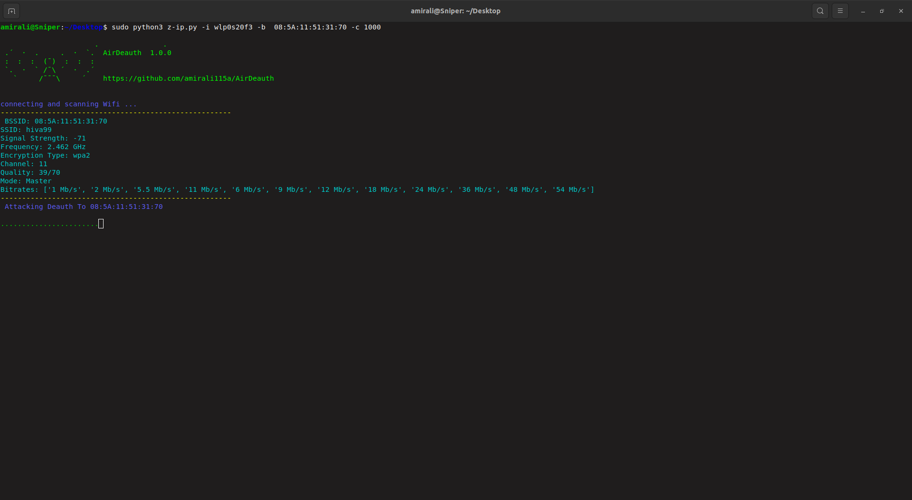

# AirDeauth
# Sharknet

the wifi jammer tool

# installation
`git clone https://github.com/amirali115a/AirDeauth `
`cd AirDeauth`
`bash install.sh `

# Attacking

`sudo python3 Sharknet.py <target mac adreess> -i <interface> -v 1 -c <count Packet for attack>  -t <packet time>`

